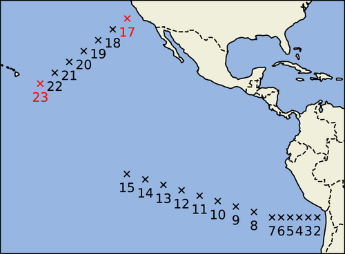

## Overview
This folder includes all the calibration files that pertain to the use of EKI with LES data, which can be found here: https://data.caltech.edu/records/a59sz-z5n11. The data is split into different cfSites and months, marking the location of the data collected and the month it was collected at, respectively. The LES data consists of data mostly belonging to the unstable surface layer, hence we calibrate only b_m and b_h of the Businger function parameters.

## How to run
The files must be run as follows:
- First, make sure you are in the root of the repository in the terminal.
- Second, run the command: julia --project
- Third, instantiate all dependencies.
- Lastly, type the line: include("LES_Code/<`filename`>")

## Contents
The core files of this folder are `load_data.jl` and `physical_model.jl`. The file `load_data.jl` loads in the cfSite data, and `physical_model.jl` represents the surface flux model. Aside from that, there exist files that use different observables to perform calibration, as well as files for data analysis and sensitivity analysis. 

### `load_data.jl`
This file defines a dataset struct that holds all of the data relevant for calibration, such as wind speed, specific humidity, and temperature at different timesteps and different heights. Its main use is the definition of the function `create_dataframe`, which, when given a cfSite and month to retrieve data from, returns a dataframe populated with the data given from the file with the given cfSite and month. It contains an optional boolean argument extrapolate_surface, which allows the user to extrapolate the values of air density and total specific humidity at the surface in the case that it is not given by the dataset. Since the LES data does not provide these values, the extrapolate_surface parameter defaults to true.

### `physical_model.jl`
This file defines the model used in each of the calibration files. The model has the arguments: parameters, parameterTypes, data, universal function type, thermodynamic state type, and solving scheme. The parameterTypes allow the user to specify which stability function parameters they want to calibrate (such as a\_m, a\_h, b\_m, b\_h). The thermodynamic state type specifies which thermodynamic function to use when establishing the thermodynamic state, to be inputted into the `surface_conditions` function from SurfaceFluxes.jl. The solving scheme is either ValuesOnly, Fluxes, or FluxesAndFrictionVelocity, which specifies the type of information provided to `surface_conditions`. This function returns a matrix of surface information, with dimensions Z x T (height dimension x time dimension). The output of this function will be used by the calibration files, where there will be an observation map H defined, which takes in this matrix and provides the observable. 

There also exists the function `physical_model_profiles`, which instead of outputting a matrix of surface information, it predicts 3 profiles over time: wind speed, moisture, and potential temperature.

### `businger_calibration.jl`
This file is the primary calibration file, using LES metrics as the observable. It calibrates the parameters b\_m and b\_h, and generates plots that display the efficacy of the calibration. There are many variables that the user can experiment with to test different results: the cfSite and month for different LES data, the UF type, the thermodynamic function used, the input container to `surface_conditions`, and even the observable used. The default observable is ustar, but it can be changed easily to sensible heat flux, latent heat flux, and a few other measures so long as it exists in the dataset and the surface information returned by `physical_model`. Running this file, the images are generated in the images/businger_calibration folder, with a custom foldername depending on the cfSite and month used. It is notable that the observable is generally overpredicted by our surface flux model given theta\_true - see my final paper for more analysis. 

### `perfect_model.jl`
This file uses an artificially generated metric as the observable - it is generated by adding Gaussian distributed noise to the model truth. Otherwise, the calibration pipeline is identical to that of `businger_calibration.jl`, and it displays excellent results - it is able to quickly reduce the error between the predictions and the observations. However, we must note that while b\_m converges towards the true b\_m of 15, the b\_h does not converge towards the true b\_h of 9. This is due to the model's insensitivity towards the parameters b\_m, making calibration difficult. 

### `linear_transformation.jl`
This file is the same as `businger_calibration.jl`, but it multiplies the output of the model by a weight and an offset to correct it. This weight and offset is calibrated by EKI in addition to b\_m and b\_h. The images are generated in the folder images/linear_transformation.

### `sensitivity.jl`
This file evaluates how sensitive the model output is to certain parameters such as b\_m, b\_h, z0, and surface temperature. It plots line plots of ustar versus time with varying parameters, and these plots can be found in images/LES_sensitivity.

### `analyze_phase_equil.jl`
This file explores the inconsistencies between the measures calculated by `Thermodynamics.jl` and the measures provided by the LES data. It establishes a thermodynamic state using various thermodynamic functions, and uses these states to infer additional metrics, which we compare agaisnt the LES data. Once this file is run, plots are generated in images/PhaseEquil_plots for all the plots. 

### `evaluate_observables.jl`
This file compares the model truth of the observable candidates: ustar, shf, lhf, buoyancy flux, and L\_MO to the given observable from the LES data. The plots are generated in the folder images/LES_observables. We note that the shape of each of the observables is consistent, but each one has an offset. 

### `multiple_observables.jl`
This file uses multiple observables - ustar, lhf, shf, and buoyancy flux to calibrate the Businger parameters. The plots are generated in the folder images/multiple_observables. 

### `recover_profile.jl`
This file uses u, q, and theta as observables. The plots are generated in the folder images/recover_profile. 

### `window_average.jl`
In this file, the observables and the model predictions are averaged over six hour periods in order to reduce noise. Only a single observable is used, which is ustar by default. The plots are generated in the folder images/window_average.

### `largescale_calibration.jl`
This file uses a collection of all downloaded cfSite and month data to perform calibration. Its goal is to discover parameters that are universal throughout all cfSites and months. Its observables are defined by the time averaged ustar at each cfSite and month, and the model predicts ustar at every altitude and timestep and then averages it. This means the number of observables is defined by the number of cfSites/months used. The plots are generated in the folder images/LES_all.

### `largescale_window.jl`
This file also uses all downloaded cfSites and months, but instead of calibrating with the ustar averaged over all timesteps, ustar is averaged in 6 hour windows just like `window_average.jl`. The plots are generated in the folder images/LES_all_window.

### `psi_observable.jl`
This file compares the model truth of the psi correction term to that given by the LES data. See the equation:

$$
\frac{u_{\star}}{\kappa}\Big[-\psi_{m}(\frac{z}{L_{mo}}) + \psi_{m}(\frac{z_{0m}}{L_{mo}})\Big]  = u(z) - \frac{u_{\star}}{\kappa}\Big[\log (\frac{z}{z_{0m}}) \Big]
$$

I manipulated the equation to isolate the psi term:

$$
-\psi_{m}(\frac{z}{L_{mo}}) + \psi_{m}(\frac{z_{0m}}{L_{mo}}) = \frac{{\kappa}u(z)}{u_{\star}} - \log (\frac{z}{z_{0m}})
$$

The right side of the equation is taken to be the observable, with values of u, u*, z, and z0m given by LES data. The model in this scenario is the Businger psi function in the SurfaceFluxes package. Once this file is run, plots of the model truth versus the data are generated in images/LES_psi.

### `phi_observable.jl`
This file compares the model truth of the phi term to that given by the LES data. See the equation: 

$$
\frac{\partial u}{\partial z} = \frac{u_{\star}}{\kappa z} \phi_{m}(\zeta)
$$

Manipulating to isolate the phi term:

$$
\frac{\kappa z}{u_{\star}} \frac{\partial u}{\partial z} = \phi_{m}(\zeta)
$$

The vertical wind speed gradient is calculated through a first order approximation. The plots are generated in images/LES_phi.

### `function_learning.jl`
This file uses GRF and EKI to perform regression to predict the psi correction term
$$
-\psi_{m}(\frac{z}{L_{mo}}) + \psi_{m}(\frac{z_{0m}}{L_{mo}}) = \frac{{\kappa}u(z)}{u_{\star}} - \log (\frac{z}{z_{0m}})
$$

This algorithm uses a Gaussian Random Field as a predictor of the psi correction term over different heights, and EKI constrains the GRF to fit to the observed psi correction term. The parameters calibrated by EKI are the coefficients of the Karhunen-Loeve expansion of the GRF; tuning these coefficients allows EKI to constrain the GRF to predict the psi correction term well. The plots are generated in images/function_leanring.