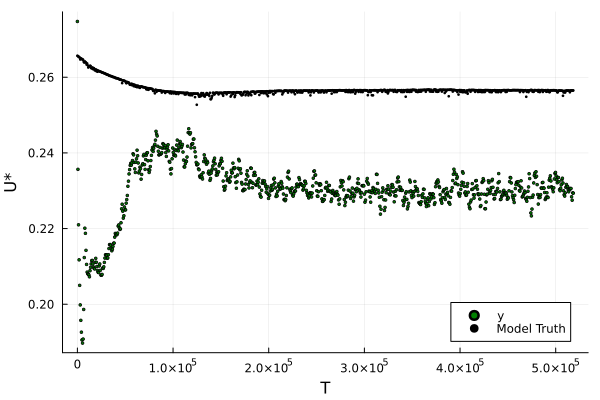
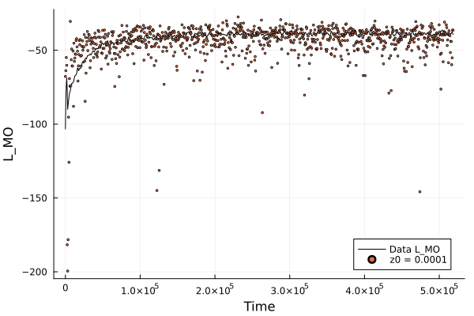
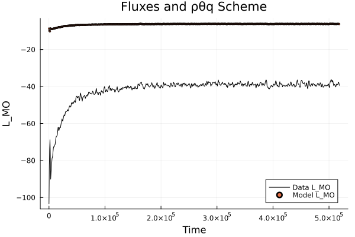
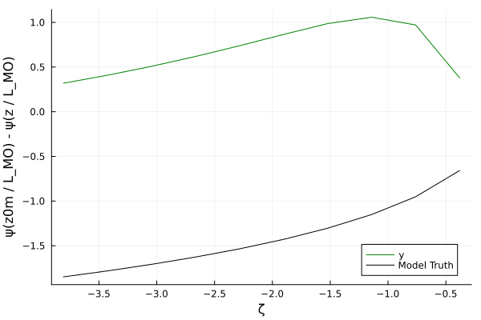

## Overview
This repository is a collection of my work on Surface Fluxes so far. Using two datasets: LES data and SHEBA data, I perform estimation of the parameters a_m, a_h, b_m, and b_h belonging to the Businger stability functions. The parameter recovery is done with Ensemble Kalman Inversion (EKI), using the EnsembleKalmanProcesses.jl package. 

## Requirements
In order to run the Julia files, the user must be up to date with all the relevant packages, with one exception. The user must add SurfaceFluxes#wd/businger-unstable-params to the dependencies rather than the latest version of SurfaceFluxes.

In order to run most of the Julia files, the user must download LES data from this link: https://data.caltech.edu/records/a59sz-z5n11. The user may have to modify code to select a specific cfSite at a specific month. Some files require SHEBA data, which can be downloaded here: https://data.eol.ucar.edu/dataset/13.114. The data must be placed into the data/ folder.

## Contents
The Julia files are split into two folders: LES_Code and SHEBA_Code. Both folders contain the following files, but performed on the LES data and the SHEBA data, respectively: perfect model experiment, calibration given with ustar observable, calibration with phi observable, calibration with psi observable, and any helper files. 

### LES Code

### `businger_calibration.jl`
The file I have spent the most time with is `businger_calibration.jl`, which uses the Ensemble Kalman Inversion process from to perform parameter estimation of Businger stability functions. In this file, you can specify the cfSite and the month of data that you intend on using, and running the file automatically creates a folder in the images/ folder with the given cfSite and month in the folder name. The folder with the images is given in the form bc\_(x)\_(y)\_(z), where x is the data's cfSite, y is the data's month, and z is to differentiate between multiple runs with the same cfSite and month. The folder contains plots that help analyze the performance of the pipeline. You can see a more detailed explanation of the code in literated/businger_calibration.md, which is a literated form of the file intending to facilitate understanding of the kalman inversion pipeline. This file has some concurrent issues, see the issues section.

### `psi_observable.jl`
Another high priority file is `psi_observable.jl`, which uses $\psi(\zeta)$ as an observable. See the equation:

$$
\frac{u_{\star}}{\kappa}\Big[-\psi_{m}(\frac{z}{L_{mo}}) + \psi_{m}(\frac{z_{0m}}{L_{mo}})\Big]  = u(z) - \frac{u_{\star}}{\kappa}\Big[\log (\frac{z}{z_{0m}}) \Big]
$$

I manipulated the equation to isolate the psi term:

$$
-\psi_{m}(\frac{z}{L_{mo}}) + \psi_{m}(\frac{z_{0m}}{L_{mo}}) = \frac{{\kappa}u(z)}{u_{\star}} - \log (\frac{z}{z_{0m}})
$$

The right side of the equation is taken to be the observable, with values of u, u*, z, and z0m given by LES data. The model in this scenario is the Businger psi function in the SurfaceFluxes package. Once this file is run, relevant plots are generated in the images/psi folder. This file also has concurrent issues, see the issues section.

### SHEBA Code

### `SHEBA_calibration.jl`
The last high priority file is `SHEBA_calibration.jl`, which uses the same pipeline as that in `businger_calibration.jl` to tune the parameters a\_m, a\_h, b\_m, and b\_h but with SHEBA data instead of LES data. Because the data collection was imperfect, the fields u_star, latent heat flux, sensible heat flux, and surface temperature have missing values. At the timesteps where these fields are missing values, I filter out the data so that all the data we are working with is valid. Because the dataset did not explicitly provide data for the heights at which observations were drawn from, I derived the heights through the hypsometric equation. These derived heights are not accurate. This file has concurrent issues, see the issues section.

### `plot_LMO.jl`
There also exists a file, `plot_LMO.jl`. This file plots the L_MO calculated through surface conditions given LES data versus the L_MO provided by the dataset. It generates 4 plots, all of which display the calculated L_MO versus the data's L_MO, but differ in implementation slightly.
1. Uses TD.PhaseEquil_ρθq to set thermodynamic state, and uses Fluxes to reach L_MO convergence. The plot is stored as fluxes_1.png.
2. Uses TD.PhaseEquil_ρθq to set thermodynamic state, and uses ValuesOnly to reach L_MO convergence. The plot is stored as values_only_1.png.
3. Uses TD.PhaseEquil_pTq to set thermodynamic state, and uses Fluxes to reach L_MO convergence. The plot is stored as fluxes_2.png.
4. Uses TD.PhaseEquil_pTq to set thermodynamic state, and uses ValuesOnly to reach L_MO convergence. The plot is stored as values_only_2.png.

The plots are generated in the folder images/L_MO_images.

### Helper files
In the helper/ folder, there exist a few graphing files: `graph_time_profiles.jl`, `graph_SHEBA_profiles.jl`, and `graph.jl`. `graph.jl` is responsible for creating the specialized folders in the images folder and populating them with the plots relevant to `businger_calibration.jl`. `graph_time_profiles.jl` plots a few LES profiles in respect to time. `graph_SHEBA_profiles` does a similar job but with SHEBA data, and this file serves to identify where data is missing (i.e. has values of 9999.0). This folder also contains `setup_parameter_set.jl`, which is used by all the calibration files in order to fetch thermodynamic parameters and Businger parameters from the CLIMAParameters package. It also contains functionality such that Julia files can override the default Businger parameters with variables that are meant to be calibrated, such as a\_m and a\_h. 

### Images
Images are placed in the images/ folder, and they are separated into folders based on the file generating the images. To reiterate the naming convention of folders generated by `businger_calibration.jl`, folders are named as bc\_(x)\_(y)\_(z). The dataset used is represented by x and y: x stands for the cfSite, y stands for the month. Since this file may be run multiple times on the same dataset, we use z to differentiate the image data from each run.

### Literated
In the literated/ folder, there exists a literated `businger_calibration.jl` markdown file that was generated using Literate.jl.
In the other/ folder, there exist a few Julia files that I used to test certain approaches or variations in the pipeline. They a
re not very important, they exist more as a reference for myself.

## Issues
### `businger_calibration.jl`
When we run `businger_calibration.jl` for multiple cfSites, we can see through the plots that the observation data y is often very far off from the model truth, with the model truth being the output of the model given true parameters for a\_m, a\_h, b\_m, and b\_h. 

If the "true" parameters result in poor model outputs, then the EKP pipeline will not have the desired final parameters.

The distinction between the model truth and the observations can be due to inaccurate roughness lengths, or simply an error in the L_MOs returned by surface_conditions. This is evident through the plots generated by `plot_LMO.jl`: when using the ValuesOnly scheme, the calculated L_MOs are accurate in respect to the LES data. However, when we shift to Fluxes, the calculated L_MOs are very poor. The first plot shows the ValuesOnly plots, and the second shows the Fluxes plots.

Although the idea of changing `businger_calibration.jl` to use the ValuesOnly scheme seems obvious, it has the unintended consequence of a multitude of unconverged fluxes. If this issue is resolved, it will likely improve the accuracy of the model truth, which will in turn improve the entire calibration process.

### `psi_observable.jl`
When we plot the model truth (the Businger psi equation given true parameters) versus the observable y, it is clear that the model is a poor fit of the observable data. As a result, calibration towards these "ideal" parameters is not feasible. I am unsure of how to fix this issue.

### `SHEBA_calibration.jl`
This file is experiencing large amounts of unconverged fluxes. This is likely due to the inaccurate derived heights.

Equations:

$$
\frac{\partial u}{\partial z} = \frac{u_{\star}}{\kappa z}
$$

$$
\frac{\partial \theta}{\partial z} = \frac{\theta _{\star}}{\kappa z}
$$

$$
u(z) = \frac{u_{\star}}{\kappa}\log (\frac{z}{z_{0m}})
$$

$$
\theta(z) - \theta _{s} = \frac{\theta _{\star}}{\kappa}\log (\frac{z}{z_{0c}})
$$

$$
\frac{\partial u}{\partial z} = \frac{u_{\star}}{\kappa z} \phi_{m}(\zeta)
$$

$$
\frac{\partial \theta}{\partial z} = \frac{\theta _{\star}}{\kappa z} \phi_{h}(\zeta)
$$

$$
u(z) = \frac{u_{\star}}{\kappa}\Big[\log (\frac{z}{z_{0m}}) - \psi_{m}(\frac{z}{L_{mo}}) + \psi_{m}(\frac{z_{0m}}{L_{mo}}) \Big]
$$

$$
\theta(z) - \theta _{s} = \frac{\theta _{\star}}{\kappa}\Big[\log (\frac{z}{z_{0c}}) - \psi_{h}(\frac{z}{L_{mo}}) + \psi_{h}(\frac{z_{0c}}{L_{mo}}) \Big]
$$